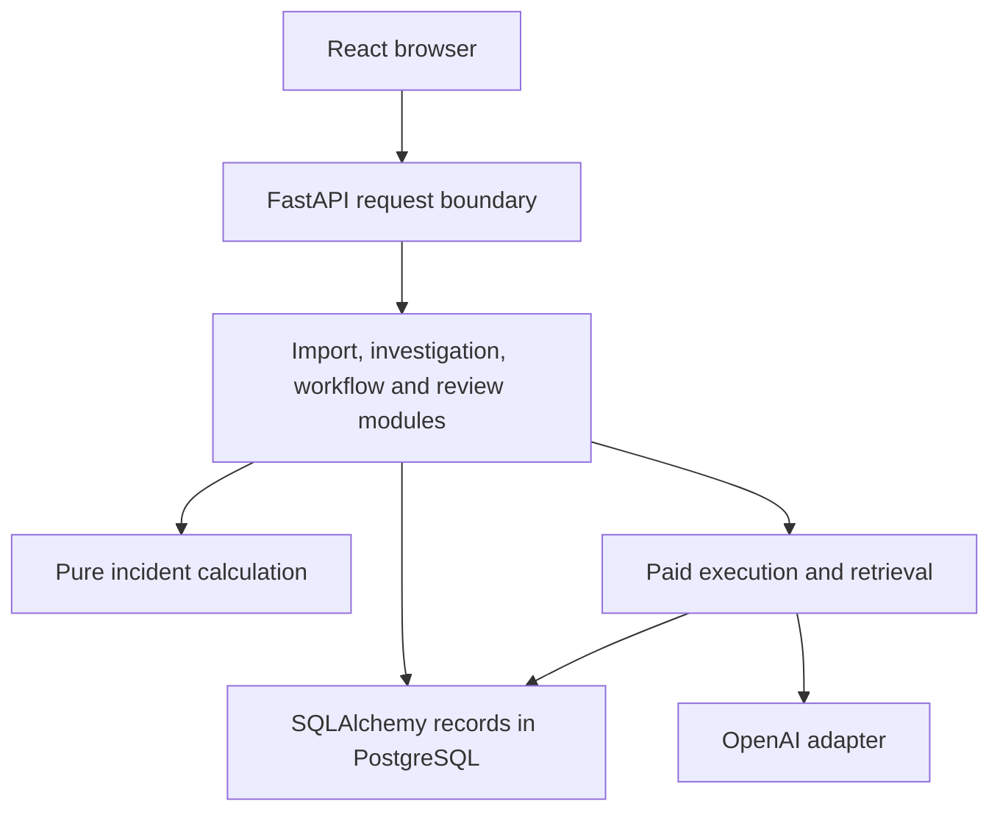

# FloorReplay architecture

## Executive summary

FloorReplay reconstructs manufacturing incidents from the evidence available at a chosen decision cutoff. The React/Vite browser calls FastAPI. PostgreSQL is the source of truth for incident revisions, original source bytes, saved analyses, workflow, reviews, accounts, sessions and provider receipts. pgvector stores embedding artifacts for historical retrieval.

Evidence revisions and saved report identities preserve earlier investigations. New evidence creates a revision instead of rewriting an earlier report. HTTP requests establish workspace scope before accessing records, and derived records inherit the workspace of their source evidence. An AI draft cannot approve a proposal or change measured production.

### System architecture

[Editable Excalidraw source](docs/diagrams/architecture.excalidraw). The backend modules run within the API application; the diagram groups them by responsibility, not as separate deployed services. The dashed arrow marks optional provider calls.

### Dependency hierarchy

The browser requests work through the API. `incident_service.py` calls the pure calculation functions in `incident_engine.py` and persists reports. Paid execution uses a server-side provider adapter. The browser receives report values and references; it does not calculate authoritative production metrics or hold provider keys.

## Request and workspace boundaries

FastAPI installs `request_scope` as an application dependency. `auth.py` identifies the account, then `workspaces.py` establishes access to the public demo and the account's workspace memberships. Request-scoped SQLAlchemy criteria restrict incident-linked records, including archive scenarios, revisions, analyses, artifacts, corpora, retrieval runs and semantic reviews.

New linked records inherit their evidence workspace. Private factory-local identifiers and retry keys are namespaced; original external IDs and raw source bytes remain available within that workspace. Legacy ownership is quarantined instead of inferred. Administrative CLI sessions are trusted root sessions and require explicit workspace selection for private corpora.

Accounts use Argon2id password hashes. The server stores hashes of random bearer tokens, expires sessions after eight hours and revokes access when an account is disabled. Owner and reviewer checks apply in local and hosted modes. Login and paid-operation limits persist in PostgreSQL.

The browser keeps its token in memory. Authentication changes clear cached queries and remount the page tree, including archive pages. Imports require a working workspace service before showing a private destination. The server's membership checks enforce access regardless of what the browser displays.

## Evidence, imports and calculation

`incident_import.py` validates source rows and binds the preview identity to the original bytes, interpretation, scope and normalized records. Publication retains that identity and the raw source artifact.

CSV imports require an explicit mapping from canonical fields to source columns, with optional constant defaults. A mapping cannot reuse a source column, name an unknown field or assign both a column and a default to the same field. The production, operation and note profiles normalize the selected values. Canonical JSON and JSONL use their existing import path. CSV mapping does not convert cumulative totals or accept XLSX. The mapping pass was verified locally on October 1, 2026; see [CSV import mapping](docs/csv-import-mapping.md).

`incident_engine.py` validates correction relationships before selecting cutoff-visible records. It combines explicit line-block intervals and calculates output from complete 15-minute final-good buckets. Typed evidence links and contradictions determine hypothesis support. Metric descriptors preserve units, formulas, intervals and source references.

`incident_service.py` pins incident and corpus identities before saving a report. Proposal review uses revision and idempotency locks and records the authenticated account ID supplied by the API. A measured shortfall does not establish its cause.

Revision comparisons show earlier metrics, newly available or corrected sources, hypothesis changes and proposal-review reminders. Follow-up questions account for blocks already established by evidence. The library separates engineering fixtures from curated incidents and provides filters and pagination. Printable deterministic reports include the revision and report identity and exclude the AI panel. Saved report bundles use engine incident-v4.

## Follow-up checks and resolution

`incident_workflow.py` stores assigned checks, append-only activities, outcomes, revision-bound resolutions and actor-scoped idempotency receipts. Workflow mutations and source publication use the same incident advisory lock. Task updates also use row locks and an expected-update timestamp. An identical request identity returns its saved result; reusing it with a changed payload conflicts.

Owners and reviewers can read workflow, assign checks, comment and record resolution within their authorized workspaces. The assignee or owner can start, respond to and complete a check. The creator or owner can cancel, reassign or change its deadline. Terminal checks accept comments and reject other edits.

A source response publishes an immutable revision and raw source artifact. HTTP source responses require a private workspace; the public synthetic example cannot receive factory observations. Task metadata and assignee lists require authentication.

Completion records an action and assessment. Resolution is a separate decision: it requires terminal checks and a completed outcome, and it pins the current revision. New evidence that supersedes that revision makes the incident effectively open again. Neither proposal approval nor check completion proves causation, factory execution or incident resolution.

The browser shows current workflow separately from the selected historical report. Printable handovers include the report cutoff, open checks and ownership. See [the workflow contract](docs/incident-workflow.md) and [the improvement plan](IMPROVEMENT_PLAN.md).

## Optional paid execution

`ai_runs.py` saves the request identity, task, configuration and evidence packet before execution. `spending.py` atomically reserves the maximum cost and one of two global execution slots under a transaction-level lock. The transaction commits before `openai_provider.py` contacts OpenAI.

The provider adapter uses the official SDK, bounded timeouts, structured outputs, `store=false` and no implicit retries. A semantic repair counts toward the two-attempt limit. The application enforces a shared ₹500 allowance divided by purpose; this ledger does not reconcile provider billing.

`incident_ai.py` validates task contracts and reference membership. It rejects generated numeric prose: metric IDs select the values rendered by the frontend. Current and historical citations remain separate. Prompt v7 and schema v2 allow narrow ordinary phrases while application references carry quantities and source values. Token checks, free-prose checks and untrusted-source instructions enforce a structural contract. They do not establish semantic truth.

Refusals, incomplete output, errors and uncertain calls become saved terminal results. A restart never silently repeats a possibly billed operation. Uncertain charges remain reserved, and request-key lookup lets the browser recover a saved result.

## Historical retrieval

`retrieval.py` publishes immutable corpus releases containing eligible historical revisions and content digests. Owner indexing is explicit and paid. Embedding cache identity includes normalized content, provider model, dimensions and preprocessing version.

Hybrid queries search a pinned release and combine exact cosine and lexical candidates with reciprocal rank fusion. They exclude the current incident lineage, future observations and development or locked cases. Lexical retrieval searches the pinned eligible corpus without generating a query embedding.

Precedent comparisons show recorded operational conditions and identify missing mechanism, intervention or outcome evidence. Retrieving a similar incident does not establish that its intervention is appropriate for the current one.

## Human review and trust evaluation

Completed AI drafts remain private until the requester or an owner publishes an exact output digest for review. `semantic_review.py` returns a sanitized packet and preserves append-only claim judgments and whole-draft assessments. Reports show each actor's latest judgments and disagreement history. Qualifications and independence are self-declared. Legacy annotations retain unspecified reviewer status. Private run lookup requires requester or owner access.

Claim annotations cover all four claim-bearing output structures and retain the output digest, rationale, authenticated actor and durable receipt. See [the AI claim review protocol](docs/ai-claim-review-protocol.md).

`trust_evaluation.py` verifies frozen release hashes and records deterministic and imported AI receipts for the same cases. `trust_live.py` dispatches only with an explicit persisted budget envelope, an existing owner and corpus, and the configured shared allowance. It refuses test databases, never automatically indexes or adds allowance, and does not repeat uncertain operations. Held-out observations retain their frozen bytes while execution metadata excludes them from public browsing and future corpora.

Historical Qwen results remain archived evidence. Recorded OpenAI evidence-only smoke, pilot and hybrid smoke runs measure structure and retain provider receipts. The locked stage stopped at a validation failure. Independent human review remains pending, and historical Qwen support labels do not establish current-provider quality. See [AI trust evaluation](docs/ai-trust-evaluation.md).

## Deployment and operations

Docker Compose runs pgvector/PostgreSQL, the API and an nginx static frontend with SPA rewrites. The hosted configuration serves the static frontend on Vercel, runs the API on Render and uses Neon PostgreSQL. Hosted frontend requests use an absolute HTTPS API base, and the API allows exact frontend origins.

Operational receipts retain allowlisted route templates, actor and request IDs, latency and failure category. Provider runs retain request correlation, provider receipt IDs and reservation identity. Expired or uncertain work remains inspectable and cannot silently dispatch again. The public replay limiter is process-local; replicated deployment requires a shared execution limiter. A worker architecture remains pending measured timeout and throughput evidence.

See [deployment](DEPLOY_VERCEL.md), [monitoring](docs/operations-monitoring.md), [recovery](docs/recovery-drill.md) and [the technical case study](docs/technical-case-study.md).

## Source map

| Responsibility | Authoritative files |
| --- | --- |
| HTTP, authentication and workspace access | [API](backend/src/flooreplay/api.py), [authentication](backend/src/flooreplay/auth.py), [workspaces](backend/src/flooreplay/workspaces.py) |
| Evidence and calculation | [imports](backend/src/flooreplay/incident_import.py), [engine](backend/src/flooreplay/incident_engine.py), [persistence](backend/src/flooreplay/incident_service.py) |
| Follow-up checks and resolution | [workflow](backend/src/flooreplay/incident_workflow.py) |
| Paid execution and retrieval | [AI runs](backend/src/flooreplay/ai_runs.py), [spending](backend/src/flooreplay/spending.py), [provider](backend/src/flooreplay/openai_provider.py), [retrieval](backend/src/flooreplay/retrieval.py) |
| Exact-output review and evaluation | [semantic review](backend/src/flooreplay/semantic_review.py), [evaluation](backend/src/flooreplay/trust_evaluation.py), [live evaluation](backend/src/flooreplay/trust_live.py) |
| Browser sessions and cache lifecycle | [session](frontend/src/lib/session.ts), [authentication provider](frontend/src/components/Auth.tsx), [routes](frontend/src/App.tsx) |
| Deployment | [Compose](docker-compose.yml), [Render](render.yaml), [Vercel](frontend/vercel.json) |

## Verification

This document reflects the current implementation and configuration. Relevant tests cover [workspace isolation](backend/tests/test_workspace_isolation.py), [incident calculation](backend/tests/test_incident_engine.py), [workflow](backend/tests/test_incident_workflow.py), [paid execution](backend/tests/test_paid_release.py), [semantic review](backend/tests/test_semantic_review.py) and [operational receipts](backend/tests/test_operations.py).

CI uses a disposable database and mocked provider calls. `release_tools.py` exports canonical saved reports and a content-digest manifest; frontend types derive from exported OpenAPI. Live model evaluation, qualified human review and authenticated hosted acceptance are separate release gates. Those tests were not rerun for this documentation edit. [Release status](RELEASE_STATUS.md) records historical checks without claiming factory validation.
