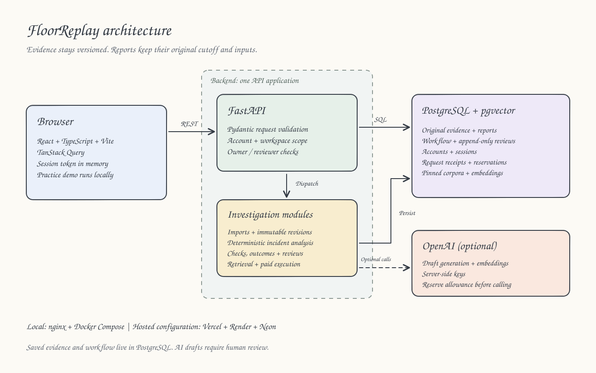

# FloorReplay

FloorReplay is a workbench for investigating manufacturing incidents. Reconstruct what was known at a decision cutoff, inspect the source behind each calculation, compare revisions, and assign follow-up checks. Corrections create new evidence revisions while earlier reports keep their original inputs.

Public examples use synthetic records. Private investigations require workspace membership. AI drafts are optional and require human review. FloorReplay has no factory pilot or measured operational benefit.

## Try the workflow

1. Open the incident library and choose "Delayed start on sewing line S4". Inspect the observed shortfall and follow an evidence reference to its source record.
2. Compare revisions to see how a late maintenance note changes the available evidence. Earlier reports retain their original inputs and cutoff.
3. Use "Practice investigation" to walk through assignment, source response, outcome and resolution in the browser. It requires no account and makes no paid requests.
4. Sign in as an owner or reviewer to work in your authorized workspaces, record proposal decisions, assign checks and export the supervisor report.

See [the demo guide](DEMO.md) and [the technical case study](docs/technical-case-study.md) for a portfolio walkthrough and the engineering decisions behind it.

## What is implemented

| Capability | Behavior |
| --- | --- |
| Evidence and revisions | Original source bytes, explicit CSV mappings, immutable revisions, knowledge cutoffs and saved report identities |
| Deterministic investigation | Source-linked production metrics, conflicting observations, missing-data handling and explicit uncertainty |
| Follow-up workflow | Assigned checks, deadlines, source responses, recorded outcomes, separate resolution and shift handover |
| Private workspaces | Server-side membership scope, owner-controlled import destinations, revocable accounts and memory-only browser sessions |
| Optional AI and retrieval | Structured drafts, citation and numeric checks, pinned historical corpora and exact-output human review |
| Operational controls | Saved request identities and receipts, a shared provider allowance, retained reservations for uncertain calls and recovery guidance |
| Browser recovery | Saved synthetic fallback, request deadlines, account-state cleanup, missing-page and error screens, and keyboard navigation |

Calculating a shortfall does not prove a cause. A retrieved historical incident does not establish that its intervention is appropriate now. Recorded proposal approval is a review decision, not factory-system execution.

## Architecture



[Edit the diagram in Excalidraw](docs/diagrams/architecture.excalidraw) or [view the SVG](docs/diagrams/architecture.svg). The dashed arrow marks optional provider calls.

The browser uses React, TypeScript, Vite and TanStack Query. FastAPI validates requests with Pydantic and accesses PostgreSQL through SQLAlchemy. PostgreSQL stores evidence, workflow and request receipts; pgvector supports hybrid retrieval. AI keys stay on the server.

The API establishes workspace scope before accessing resources. Derived records retain their source workspace. Provider operations reserve a shared allowance before dispatch and retain that reservation when the charge is uncertain. The public replay limiter is bounded and process-local, so a replicated deployment needs a shared execution limiter.

See [ARCHITECTURE.md](ARCHITECTURE.md), [the workflow contract](docs/incident-workflow.md), [CSV import mapping](docs/csv-import-mapping.md), and [the AI review protocol](docs/ai-claim-review-protocol.md).

## Run locally

With Docker Desktop or Docker Engine:

```sh
docker compose up --build --wait
```

Open [the application](http://localhost:5174). The API and database bind to loopback ports 8001 and 5434. Startup runs migrations and seeds the database. Repeated startup does not duplicate seed data or make paid calls.

Create individual accounts with prompted passwords:

```sh
docker compose exec api python -m flooreplay account-create owner --role owner
docker compose exec api python -m flooreplay account-create reviewer --role reviewer
```

For local development use Python 3.12+, uv 0.12.19, Node 22.12+ and pnpm 10.30.0. PostgreSQL must provide pgvector.

```sh
cd backend
cp .env.example .env
uv sync --frozen --no-install-project --no-build
uv sync --frozen --no-build
uv run alembic upgrade head
uv run python -m flooreplay seed
uv run python -m flooreplay account-create owner --role owner
uv run uvicorn flooreplay.api:app --port 8000
```

In a second shell, run `cd frontend && pnpm install --frozen-lockfile --ignore-scripts && pnpm dev`. These commands disable dependency lifecycle scripts. Python dependencies must install from wheels; the repository's own reviewed Hatch build is permitted.

Sessions expire after eight hours. Browser reloads require signing in again. Disabling an account revokes its access immediately.

## Verification and release evidence

CI checks backend lint, types, database behavior and dependencies. It also checks frontend lint, the build, dependencies and browser behavior, along with migrations, seed data, generated contracts and deployment configuration. Tests must use an isolated, disposable database whose name ends in `_test`.

```sh
make verify
make dataset-verify
make e2e
cd backend && uv audit --frozen
cd frontend && pnpm audit --audit-level high
```

[Release status](RELEASE_STATUS.md) preserves historical results. [The final review](docs/final-review.md) records the current changes and separates static and advisory checks from pending runtime acceptance. Earlier public hosted checks do not verify the current working tree or authenticated production flows.

The synthetic dataset, frozen challenge cases and saved provider receipts let reviewers inspect the software. Qualified independent human review of AI claims, factory validation and measurements of usefulness remain pending. A valid output schema or passing software test does not establish operational accuracy.

## Optional provider configuration

Set `FLOORREPLAY_OPENAI_API_KEY` only in the backend environment. Generation uses the configured pinned model; embeddings use the configured embedding model with 512 dimensions. The browser bundle contains no provider key. The application enforces a fixed ₹500 allowance divided by purpose. It does not reconcile that allowance with provider billing.

See [AI trust evaluation](docs/ai-trust-evaluation.md) for existing measurements and remaining gates. Seeding, migrations and the practice demo never initiate paid calls.

## Deployment

Follow [DEPLOY_VERCEL.md](DEPLOY_VERCEL.md) for Vercel, Render and Neon, or [DEPLOY.md](DEPLOY.md) for container verification, backups and recovery. Before deploying with real data, complete authenticated acceptance checks, confirm TLS and proxy settings, define backup ownership and retention, and assign an operational owner. This synthetic demonstration has not been validated for factory decisions.

## Engineering evidence

Read the [technical case study](docs/technical-case-study.md) for architecture decisions, failures, verification results, hosted observations and measured local recovery. [Release evidence](RELEASE_STATUS.md) records local private-workspace verification separately from pending authenticated hosted acceptance and factory benefit that has yet to be measured.
